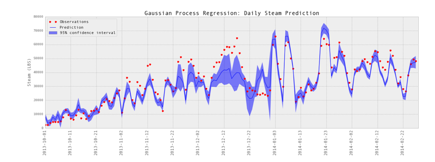

Introduction
- Allows automatic selection of changepoint
- Incorporates uncertainty in location of changepoint

Data
- 1 year of hourly data
- Load in kW
- Temperature in F
- Commercial office(?) building in CA
- No knowledge of occupancy patterns or thermostat behavior
- Assume occupied 7am-8pm, only fit model to occupied data
- Exclude missing data
- ~3400 observations

Method
- Model of load as function of temperature:
  - Piecewise linear
  - 2 change points at unknown locations
  - 6 parameters: 2 change points, 3 slopes, 1 offset
- Consider 200k scenarios, each scenario with different set of parameters
- Assign prior probability to each scenario by assuming distribution of each parameter
- Prior distributions are normal with mean and variance from rough look at data
- For each scenario, compute likelihood = product of error distribution over all observations (assume i.i.d., but actually temperature is autocorrelated)
- Distribution of errors (measured - predicted):
  - Normal
  - Mean = 0
  - variance chosen to be large (1000)
  - Assigned minimum value (0.005)
- For each scenario, posterior = prior * likelihood
- Normalize posterior

Results
- Figure 1: histograms of prior and posterior distributions for each parameter
- Figure 2: measured and predicted load as a function of temperature
  - Predicted load for mean, mean + 3*stdev, and mean - 3*stdev
  - Mean etc. computed over all scenarios weighted by posterior probabilities
  - Small stdev near middle, larger near right changepoint and outside changepoints
- Figure 3: measured and predicted load as function of time
  - Predicted load for mean, mean + 3*stdev, and mean - 3*stdev (as in Figure 3)
  - Many points connected by lines erroneously (NaNs shouldn’t be connected)
  - Model seems reasonable in summer, but not during fall/winter/spring (too flat)
- Figure 4: predicted vs. measured load
  - Predicted load for mean only
  - Measured load frequently below 400, but predictions never below 400. Why?

Conclusions
